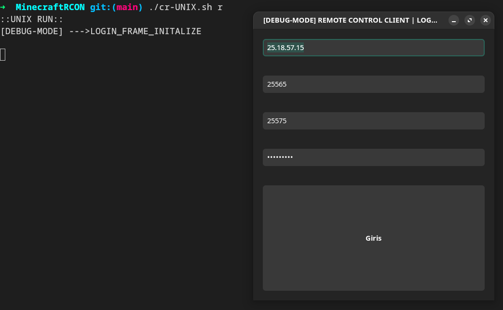
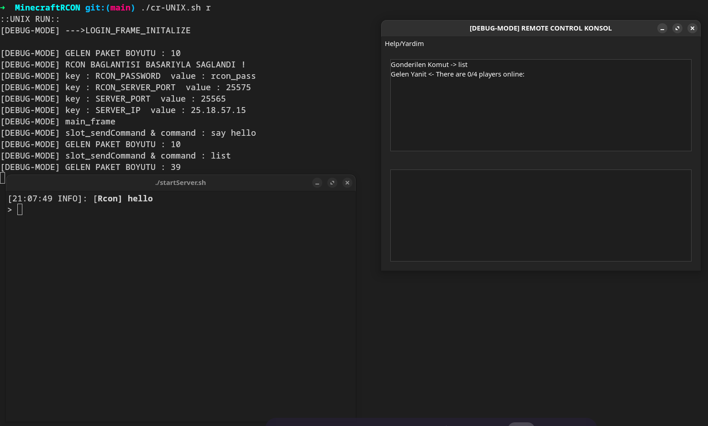
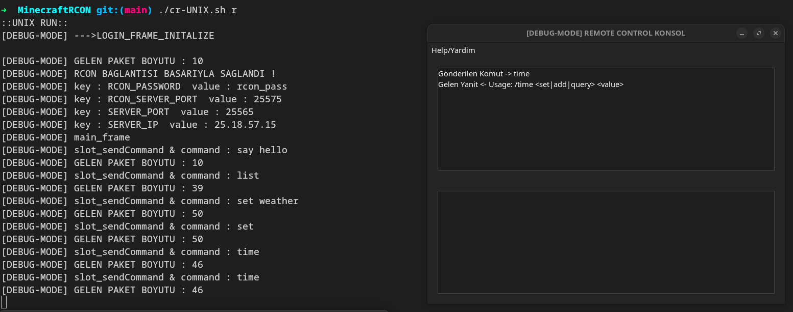
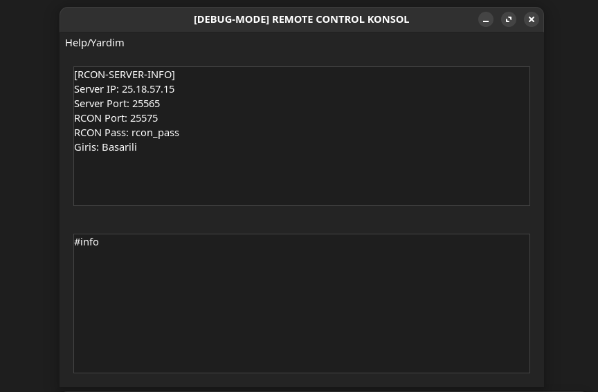

# RCON Protocol Client 

## Bağımlılıklar ve build işleminin yapılması

```sh
#linux bagimliliklarin kurulmasi
sudo pacman -S boost boost-libs websocketpp wxwidgets-gtk3 wxwidgets-common #Arch
sudo apt-get install libboost-all-dev libwebsocketpp-dev libwxgtk3.0-gtk3-dev libwxbase3.0-dev #Debian/Ubuntu 
```

```sh
#linux build release/debug
git clone https://github.com/why20w18/RCON-Protocol-Client.git && cd RCON-Protocol-Client
cr-UNIX.sh debug-compile #debug modda derleme
#cr-UNIX.sh compile      #release mod derleme
cr-UNIX.sh run
```

```sh
#win32 build release ve bagimliliklarin kurulmasi , sistemde wine yoksa kurulmalidir
git clone https://github.com/why20w18/RCON-Protocol-Client.git && cd RCON-Protocol-Client
wget https://github.com/why20w18/RCON-Protocol-Client/releases/download/utils-WIN32/utils-WIN32.zip
unzip utils-WIN32.zip
rm -rf utils-WIN32.zip
cr-WIN32.sh compile
cr-WIN32.sh run
```


## RCON Protocol paketinin oluşturulması
RCON Protokolünün implementasyonu rcon.hpp/rcon.cpp dosyasında manuel yapılmıştır , protokolü
özelleştirerek Minecraft dışında diğer RCON kullanan uygulamalarla da çalıştırılabilir hale 
getirilebilirsiniz

### Kullanılan kaynaklar
[Minecraft Wiki RCON](https://minecraft.wiki/w/RCON)

[Valve Source RCON Protocol](https://developer.valvesoftware.com/wiki/Source_RCON_Protocol)


| Alan adı          | Alan türü         | Açıklamalar   |
| -------------     | -------------     | ------------- |
| Length            | int32             | RCON paketinin boyutunun Length alanı dışında kalan kısmının boyutunu tutar | 
| Request ID        | int32             | Client tarafından üretilen ID değeridir server aynı ID üzerinden geri cevap döndürür|
| Type              | int32             | Paketin gönderilme amacını içeren kısım , 3=RCON parola doğrulama , 2=server üzerinde komut çalıştırma|
| Payload           | byte[]            | Asıl verinin taşındığı kısımdır örneğin RCON parolası veya çalıştırılacak komut buradadır (payloadByte+1) null karakterle biter|
| Pad               | byte              | Bellek hizalama için kullanılan 1 byte null karakter|


## Kullanılan çapraz platform kütüphaneler


| Kütüphaneler      | Kullanım Amacı                               |
| -------------     | -------------                                |
| wxWidgets         | platform bağımsız gui oluşturmak için kullanıldı| 
| Boost:Asio        | platform bağımsız io işlemlerini oluşturmak için kullanıldı|
| sqlite3           | cmake konfigürasyonu oluşturuldu fakat kullanılmadı|


## Eklemeler ve düzeltmeler

>
 + configParser.cpp/configParser.hpp settings.cfg dosyasından otomatik okuma yaparak doğrudan REMOTE CONTROL penceresini başlatabilmelidir
 + serverdan gelen uzun yanıtlar tam olarak GUI üzerinde gösterilemiyor düzeltilmeli
 + ayarlar kısmı eklenerek özelleştirmeler yapılabilmelidir


## Screenshot



## 



## 



## 



